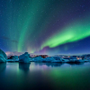

# LIFX Themes

This repository provides information about the themes that are available in the [LIFX](https://www.lifx.com) App in the following formats:

- **Markdown (this file):** [Autumn](#autumn), [Blissful](#blissful), [Cheerful](#cheerful), [Dream](#dream), [Energizing](#energizing), [Epic](#epic), [Exciting](#exciting), [Focusing](#focusing), [Halloween](#halloween), [Hanukkah](#hanukkah), [Holly](#holly), [Independence Day](#independence-day), [Intense](#intense), [Mellow](#mellow), [Peaceful](#peaceful), [Powerful](#powerful), [Relaxing](#relaxing), [Santa](#santa), [Serene](#serene), [Soothing](#soothing), [Sports](#sports), [Spring](#spring), [Tranquil](#tranquil), [Warming](#warming)
- **JSON:**
  - **Pretty printed:** [lifx-themes-hex-hsbk-rgb.json](json/lifx-themes-hex-hsbk-rgb.json), [lifx-themes-hex.json](json/lifx-themes-hex.json), [lifx-themes-hsbk.json](json/lifx-themes-hsbk.json), [lifx-themes-rgb.json](json/lifx-themes-rgb.json)
  - **Minified:** [lifx-themes-hex-hsbk-rgb.min.json](json/lifx-themes-hex-hsbk-rgb.min.json), [lifx-themes-hex.min.json](json/lifx-themes-hex.min.json), [lifx-themes-hsbk.min.json](json/lifx-themes-hsbk.min.json), [lifx-themes-rgb.min.json](json/lifx-themes-rgb.min.json)

## Autumn

|                                   # |                  0                   |                  1                   |                  2                   |                  3                   |
| -----------------------------------:|:------------------------------------:|:------------------------------------:|:------------------------------------:|:------------------------------------:|
|  |  |  |  |  |
|                            **HSBK** |            31,100,50,3500            |            83,100,50,3500            |            49,100,50,3500            |            58,100,50,3500            |
|                             **RGB** |               128,66,0               |               79,128,0               |              128,104,0               |              128,123,0               |
|                         **#RRGGBB** |               #804200                |               #4f8000                |               #806800                |               #807b00                |

## Blissful

|                                       # |                  0                   |                  1                   |                  2                   |                  3                   |                  4                   |                  5                   |                  6                   |
| ---------------------------------------:|:------------------------------------:|:------------------------------------:|:------------------------------------:|:------------------------------------:|:------------------------------------:|:------------------------------------:|:------------------------------------:|
|  |  |  |  |  |  |  |  |
|                                **HSBK** |            303,18,82,3500            |            232,46,53,3500            |            252,37,69,3500            |            245,29,81,3500            |            303,37,18,3500            |           56,100,100,3500            |            321,39,78,3500            |
|                                 **RGB** |             209,171,207              |              73,81,135               |             124,111,176              |             152,147,207              |               46,29,45               |              255,238,0               |             199,121,172              |
|                             **#RRGGBB** |               #d1abcf                |               #495187                |               #7c6fb0                |               #9893cf                |               #2e1d2d                |               #ffee00                |               #c779ac                |

## Cheerful

|                                       # |                  0                   |                  1                   |                  2                   |                  3                   |                  4                   |
| ---------------------------------------:|:------------------------------------:|:------------------------------------:|:------------------------------------:|:------------------------------------:|:------------------------------------:|
|  |  |  |  |  |  |
|                                **HSBK** |           310,100,100,3500           |            266,87,47,3500            |           248,100,60,3500            |            51,100,67,3500            |            282,90,67,3500            |
|                                 **RGB** |              255,0,212               |              61,16,120               |               20,0,153               |              171,145,0               |              125,17,171              |
|                             **#RRGGBB** |               #ff00d4                |               #3d1078                |               #140099                |               #ab9100                |               #7d11ab                |

## Dream

|                                 # |                  0                   |                  1                   |                  2                   |                  3                   |                  4                   |                  5                   |                  6                   |
| ---------------------------------:|:------------------------------------:|:------------------------------------:|:------------------------------------:|:------------------------------------:|:------------------------------------:|:------------------------------------:|:------------------------------------:|
|  |  |  |  |  |  |  |  |
|                          **HSBK** |            201,76,23,3500            |            183,75,32,3500            |            199,22,62,3500            |            223,22,91,3500            |            219,29,52,3500            |            167,62,55,3500            |            201,76,23,3500            |
|                           **RGB** |               14,43,59               |               20,79,82               |             123,147,158              |             181,195,232              |              94,108,133              |              53,140,121              |               14,43,59               |
|                       **#RRGGBB** |               #0e2b3b                |               #144f52                |               #7b939e                |               #b5c3e8                |               #5e6c85                |               #358c79                |               #0e2b3b                |

## Energizing

|                                           # |                  0                   |                  1                   |                  2                   |                  3                   |                  4                   |                  5                   |
| -------------------------------------------:|:------------------------------------:|:------------------------------------:|:------------------------------------:|:------------------------------------:|:------------------------------------:|:------------------------------------:|
|  |  |  |  |  |  |  |
|                                    **HSBK** |             0,0,100,9000             |           205,47,100,3500            |           191,89,100,3500            |           242,100,42,3500            |            180,87,27,3500            |             0,0,30,9000              |
|                                     **RGB** |             255,255,255              |             135,205,255              |              28,213,255              |               4,0,107                |               9,69,69                |               77,77,77               |
|                                 **#RRGGBB** |               #ffffff                |               #87cdff                |               #1cd5ff                |               #04006b                |               #094545                |               #4d4d4d                |

## Epic

|                               # |                  0                   |                  1                   |                  2                   |                  3                   |                  4                   |                  5                   |
| -------------------------------:|:------------------------------------:|:------------------------------------:|:------------------------------------:|:------------------------------------:|:------------------------------------:|:------------------------------------:|
|  |  |  |  |  |  |  |
|                        **HSBK** |           226,100,96,3500            |           233,100,49,3500            |            184,60,57,3500            |            249,29,95,3500            |            261,84,58,3500            |            294,78,51,3500            |
|                         **RGB** |               0,57,245               |               0,15,125               |              58,140,145              |             183,172,242              |              67,24,148               |              120,29,130              |
|                     **#RRGGBB** |               #0039f5                |               #000f7d                |               #3a8c91                |               #b7acf2                |               #431894                |               #781d82                |

## Exciting

|                                       # |                  0                   |                  1                   |                  2                   |                  3                   |                  4                   |                  5                   |                  6                   |
| ---------------------------------------:|:------------------------------------:|:------------------------------------:|:------------------------------------:|:------------------------------------:|:------------------------------------:|:------------------------------------:|:------------------------------------:|
|  |  |  |  |  |  |  |  |
|                                **HSBK** |            0,100,100,3500            |           40,100,100,3500            |           60,100,100,3500            |           122,100,100,3500           |           239,100,100,3500           |           271,100,100,3500           |           294,100,100,3500           |
|                                 **RGB** |               255,0,0                |              255,170,0               |              255,255,0               |               0,255,8                |               0,4,255                |              132,0,255               |              230,0,255               |
|                             **#RRGGBB** |               #ff0000                |               #ffaa00                |               #ffff00                |               #00ff08                |               #0004ff                |               #8400ff                |               #e600ff                |

## Focusing

|                                       # |                  0                   |                  1                   |                  2                   |                  3                   |                  4                   |
| ---------------------------------------:|:------------------------------------:|:------------------------------------:|:------------------------------------:|:------------------------------------:|:------------------------------------:|
|  |  |  |  |  |  |
|                                **HSBK** |           338,38,100,3500            |            42,36,100,3500            |            52,21,100,3500            |             0,0,100,9000             |             0,0,100,2500             |
|                                 **RGB** |             255,158,194              |             255,227,163              |             255,248,201              |             255,255,255              |             255,255,255              |
|                             **#RRGGBB** |               #ff9ec2                |               #ffe3a3                |               #fff8c9                |               #ffffff                |               #ffffff                |

## Halloween

|                                         # |                  0                   |                  1                   |                  2                   |                  3                   |                  4                   |                  5                   |
| -----------------------------------------:|:------------------------------------:|:------------------------------------:|:------------------------------------:|:------------------------------------:|:------------------------------------:|:------------------------------------:|
|  |  |  |  |  |  |  |
|                                  **HSBK** |           31,100,100,3500            |            32,100,60,2800            |           32,100,100,4200            |            33,100,60,4900            |           33,100,100,2450            |            34,100,70,2800            |
|                                   **RGB** |              255,132,0               |               153,82,0               |              255,136,0               |               153,84,0               |              255,140,0               |              179,101,0               |
|                               **#RRGGBB** |               #ff8400                |               #995200                |               #ff8800                |               #995400                |               #ff8c00                |               #b36500                |

## Hanukkah

|                                       # |                  0                   |                  1                   |                  2                   |                  3                   |                  4                   |                  5                   |
| ---------------------------------------:|:------------------------------------:|:------------------------------------:|:------------------------------------:|:------------------------------------:|:------------------------------------:|:------------------------------------:|
|  |  |  |  |  |  |  |
|                                **HSBK** |           213,52,100,3500            |           219,100,100,3500           |             0,0,32,7000              |           199,100,34,3500            |           232,100,35,3500            |            225,25,13,3500            |
|                                 **RGB** |             122,182,255              |               0,89,255               |               82,82,82               |               0,59,87                |               0,12,89                |               25,27,33               |
|                             **#RRGGBB** |               #7ab6ff                |               #0059ff                |               #525252                |               #003b57                |               #000c59                |               #191b21                |

## Holly

|                                 # |                  0                   |                  1                   |                  2                   |                  3                   |                  4                   |
| ---------------------------------:|:------------------------------------:|:------------------------------------:|:------------------------------------:|:------------------------------------:|:------------------------------------:|
|  |  |  |  |  |  |
|                          **HSBK** |           117,100,100,3500           |           116,90,100,3500            |            1,100,100,3500            |           118,100,50,3500            |           360,100,90,3500            |
|                           **RGB** |               13,255,0               |              41,255,25               |               255,4,0                |               4,128,0                |               230,0,0                |
|                       **#RRGGBB** |               #0dff00                |               #29ff19                |               #ff0400                |               #048000                |               #e60000                |

## Independence Day

|                                                       # |                  0                   |                  1                   |                  2                   |
| -------------------------------------------------------:|:------------------------------------:|:------------------------------------:|:------------------------------------:|
|  |  |  |  |
|                                                **HSBK** |            360,0,100,3500            |           360,100,100,3500           |           240,100,100,3500           |
|                                                 **RGB** |             255,255,255              |               255,0,0                |               0,0,255                |
|                                             **#RRGGBB** |               #ffffff                |               #ff0000                |               #0000ff                |

## Intense

|                                     # |                  0                   |                  1                   |                  2                   |                  3                   |
| -------------------------------------:|:------------------------------------:|:------------------------------------:|:------------------------------------:|:------------------------------------:|
|  |  |  |  |  |
|                              **HSBK** |           242,75,100,3500            |           300,100,87,3500            |           164,99,100,3500            |           248,100,23,3500            |
|                               **RGB** |              70,64,255               |              222,0,222               |              3,255,188               |                8,0,59                |
|                           **#RRGGBB** |               #4640ff                |               #de00de                |               #03ffbc                |               #08003b                |

## Mellow

|                                   # |                  0                   |                  1                   |                  2                   |                  3                   |                  4                   |
| -----------------------------------:|:------------------------------------:|:------------------------------------:|:------------------------------------:|:------------------------------------:|:------------------------------------:|
|  |  |  |  |  |  |
|                            **HSBK** |            359,31,59,3500            |            315,24,82,3500            |           241,100,40,3500            |            256,36,50,3500            |             79,5,40,3500             |
|                             **RGB** |             150,104,105              |             209,159,197              |               2,0,102                |              94,82,128               |              100,102,97              |
|                         **#RRGGBB** |               #966869                |               #d19fc5                |               #020066                |               #5e5280                |               #646661                |

## Peaceful

|                                       # |                  0                   |                  1                   |                  2                   |                  3                   |                  4                   |
| ---------------------------------------:|:------------------------------------:|:------------------------------------:|:------------------------------------:|:------------------------------------:|:------------------------------------:|
|  |  |  |  |  |  |
|                                **HSBK** |            198,48,11,3500            |             2,46,85,3500             |            54,36,85,3500             |             4,63,56,3500             |            203,34,56,3500            |
|                                 **RGB** |               15,24,28               |             217,120,117              |             217,209,139              |              143,59,53               |              94,124,143              |
|                             **#RRGGBB** |               #0f181c                |               #d97875                |               #d9d18b                |               #8f3b35                |               #5e7c8f                |

## Powerful

|                                       # |                  0                   |                  1                   |                  2                   |                  3                   |                  4                   |                  5                   |                  6                   |
| ---------------------------------------:|:------------------------------------:|:------------------------------------:|:------------------------------------:|:------------------------------------:|:------------------------------------:|:------------------------------------:|:------------------------------------:|
|  |  |  |  |  |  |  |  |
|                                **HSBK** |            10,99,66,3500             |            59,70,98,3500             |            11,99,41,3500             |            61,44,99,3500             |            18,98,98,3500             |            52,88,97,3500             |            52,88,97,3500             |
|                                 **RGB** |               168,29,2               |              250,247,75              |               105,20,1               |             251,252,141              |               250,78,5               |              247,218,30              |              247,218,30              |
|                             **#RRGGBB** |               #a81d02                |               #faf74b                |               #691401                |               #fbfc8d                |               #fa4e05                |               #f7da1e                |               #f7da1e                |

## Relaxing

|                                       # |                  0                   |                  1                   |                  2                   |                  3                   |
| ---------------------------------------:|:------------------------------------:|:------------------------------------:|:------------------------------------:|:------------------------------------:|
|  |  |  |  |  |
|                                **HSBK** |           110,95,100,3500            |           71,100,100,3500            |            123,85,33,3500            |            120,50,10,3500            |
|                                 **RGB** |              53,255,13               |              208,255,0               |               13,84,16               |               13,26,13               |
|                             **#RRGGBB** |               #35ff0d                |               #d0ff00                |               #0d5410                |               #0d1a0d                |

## Santa

|                                 # |                  0                   |                  1                   |                  2                   |                  3                   |
| ---------------------------------:|:------------------------------------:|:------------------------------------:|:------------------------------------:|:------------------------------------:|
|  |  |  |  |  |
|                          **HSBK** |            0,100,100,3500            |            351,5,100,3500            |            2,100,58,3500             |             0,0,52,6000              |
|                           **RGB** |               255,0,0                |             255,242,244              |               148,5,0                |             133,133,133              |
|                       **#RRGGBB** |               #ff0000                |               #fff2f4                |               #940500                |               #858585                |

## Serene

|                                   # |                  0                   |                  1                   |                  2                   |                  3                   |                  4                   |                  5                   |                  6                   |
| -----------------------------------:|:------------------------------------:|:------------------------------------:|:------------------------------------:|:------------------------------------:|:------------------------------------:|:------------------------------------:|:------------------------------------:|
|  |  |  |  |  |  |  |  |
|                            **HSBK** |            179,10,91,3500            |            215,85,98,3500            |            205,44,37,3500            |            94,63,25,3500             |            100,26,42,3500            |            132,46,88,3500            |            211,73,97,3500            |
|                             **RGB** |             209,232,232              |              37,126,250              |               53,77,94               |               41,64,24               |              89,107,79               |             121,224,142              |              67,154,247              |
|                         **#RRGGBB** |               #d1e8e8                |               #257efa                |               #354d5e                |               #294018                |               #596b4f                |               #79e08e                |               #439af7                |

## Soothing

|                                       # |                  0                   |                  1                   |                  2                   |                  3                   |                  4                   |
| ---------------------------------------:|:------------------------------------:|:------------------------------------:|:------------------------------------:|:------------------------------------:|:------------------------------------:|
|  |  |  |  |  |  |
|                                **HSBK** |            336,18,67,3500            |            335,50,67,3500            |             0,0,100,8000             |           302,69,100,3500            |            330,45,58,3500            |
|                                 **RGB** |             171,140,152              |              171,85,121              |             255,255,255              |              255,79,249              |              148,81,115              |
|                             **#RRGGBB** |               #ab8c98                |               #ab5579                |               #ffffff                |               #ff4ff9                |               #945173                |

## Sports

|                                   # |                  0                   |                  1                   |                  2                   |
| -----------------------------------:|:------------------------------------:|:------------------------------------:|:------------------------------------:|
|  |  |  |  |
|                            **HSBK** |            59,81,96,3500             |           120,100,96,3500            |           120,74,100,3500            |
|                             **RGB** |              245,241,47              |               0,245,0                |              66,255,66               |
|                         **#RRGGBB** |               #f5f12f                |               #00f500                |               #42ff42                |

## Spring

|                                   # |                  0                   |                  1                   |                  2                   |                  3                   |
| -----------------------------------:|:------------------------------------:|:------------------------------------:|:------------------------------------:|:------------------------------------:|
|  |  |  |  |  |
|                            **HSBK** |           184,100,50,3500            |           299,100,50,3500            |            49,100,50,3500            |           198,100,50,3500            |
|                             **RGB** |              0,119,128               |              125,0,128               |              128,104,0               |               0,89,128               |
|                         **#RRGGBB** |               #007780                |               #7d0080                |               #806800                |               #005980                |

## Tranquil

|                                       # |                  0                   |                  1                   |                  2                   |                  3                   |                  4                   |                  5                   |
| ---------------------------------------:|:------------------------------------:|:------------------------------------:|:------------------------------------:|:------------------------------------:|:------------------------------------:|:------------------------------------:|
|  |  |  |  |  |  |  |
|                                **HSBK** |              0,0,0,8500              |            205,74,96,3500            |            203,94,96,3500            |           241,99,100,3500            |            37,75,99,3500             |            43,83,53,3500             |
|                                 **RGB** |                0,0,0                 |              64,169,245              |              15,157,245              |               7,3,255                |              252,180,63              |              135,103,23              |
|                             **#RRGGBB** |               #000000                |               #40a9f5                |               #0f9df5                |               #0703ff                |               #fcb43f                |               #876717                |

## Warming

|                                     # |                  0                   |                  1                   |                  2                   |                  3                   |                  4                   |                  5                   |
| -------------------------------------:|:------------------------------------:|:------------------------------------:|:------------------------------------:|:------------------------------------:|:------------------------------------:|:------------------------------------:|
|  |  |  |  |  |  |  |
|                              **HSBK** |            4,100,76,3500             |            42,36,96,3500             |            355,81,86,3500            |            44,44,65,3500             |            51,85,59,3500             |             0,0,30,3500              |
|                               **RGB** |               194,13,0               |             245,218,157              |              219,42,56               |              166,146,93              |              150,131,23              |               77,77,77               |
|                           **#RRGGBB** |               #c20d00                |               #f5da9d                |               #db2a38                |               #a6925d                |               #968317                |               #4d4d4d                |

